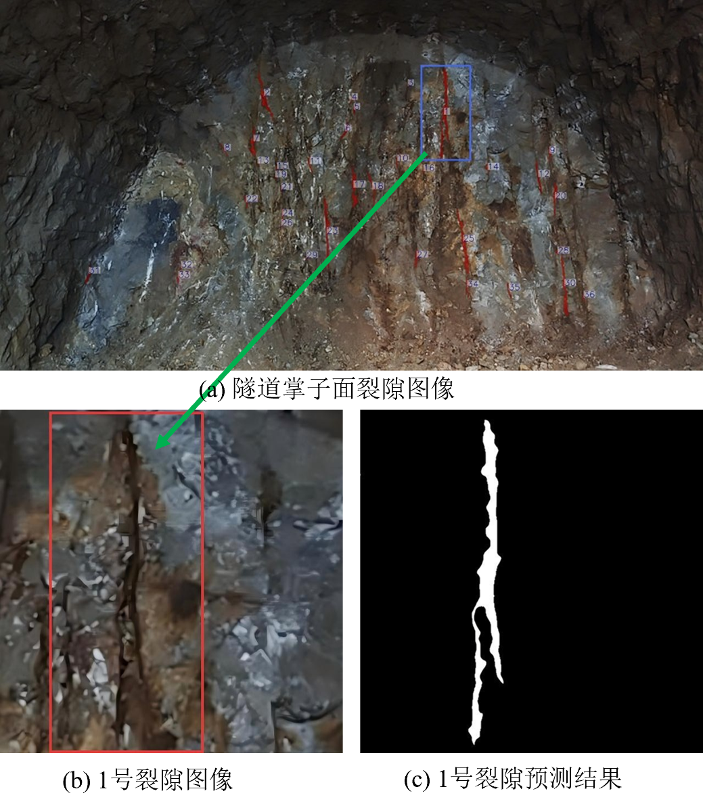
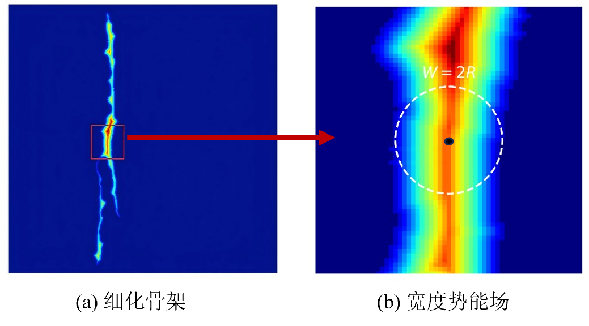
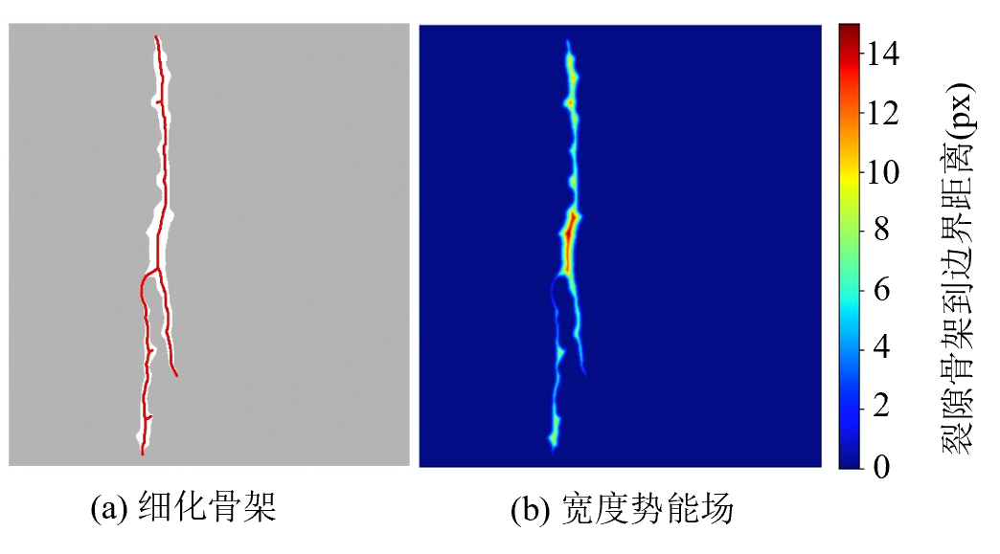

🚇 MDC-Net: Tunnel Fracture Intelligent Perception & Quantification System

⚠️ Data Privacy Disclaimer (数据脱敏声明): > Due to strict commercial confidentiality agreements (NDA) with our industry partners, the proprietary 4K tunnel face dataset and pre-trained weights (.pth) cannot be open-sourced.
This repository contains the core algorithmic framework, pipeline logic, and an extracted dummy_data sample solely for engineering verification.

中文版本 (Chinese)

📌 项目概述 (Project Overview)

本项目是一个面向真实工业落地场景的隧道掌子面裂隙识别与工程参数量化系统 (PoC Demonstration)。

针对边缘端设备算力受限（4GB VRAM）、正负样本极度不平衡、以及长裂隙易断裂等工业痛点，本项目提出了一套涵盖**“极轻量化模型设计、高并发大图推理融合、专家在环 (HITL) 纠错闭环”**的端到端解决方案。

💡 核心性能指标 (Benchmarks)

参数量极低：1.82 M (可轻松部署于无人机载或便携式边缘算力盒子)

边缘端极速：203.45 FPS (本地单卡 RTX 3050 Laptop, 4GB VRAM 极限压榨)

亚像素高精度：物理长度误差 ~4%，宽度提取误差控制在 0.53 Pixel。

✨ 核心特性 & 工程原理 (Key Features & Principles)

1. 复杂掌子面场景的高效分割 (Complex Scene Segmentation)

面对隧道掌子面水渍、粉尘、探照灯光斑等高频噪声，MDC-Net 结合 CoordAtt 与空洞大核注意力 (D-LKA)，精准剥离复杂背景，提取高置信度裂隙掩膜。

<em>图 1: 真实隧道环境下的长裂隙跨尺度提取与二值化掩膜 (Binary Mask)</em>

2. “宁错杀不漏检”的损失函数 (Recall-Focused Loss)

融合 Tversky Loss 与带 pos_weight 的 BCE Loss。在训练阶段强迫网络对“漏检 (False Negative)”极度敏感，完美契合工程安全领域“零漏报”的业务需求。

3. C-HTP 拓扑解析与亚像素量化 (Topology Parsing & Quantification)

传统的像素统计法无法处理裂隙交叉与网状结构。本项目自研了 C-HTP 拓扑解耦算法：

构建宽度势能场 (EDT Field) 实现亚像素级裂隙宽度测量。

结合图论 (Graph Theory) 进行最短路径搜索，自动剔除次生分支噪声，缝合主裂隙。

<em>图 2: (左) 基于 EDT 的宽度势能场构建；(右) 基于图论的主裂隙与次生分支解耦算法</em>

4. HITL 专家在环与量化闭环 (Human-In-The-Loop)

基于 Streamlit 开发 PoC 前端。允许领域专家对 AI 的误检进行手动涂抹修正，后台算法实时重算工程参数并更新报表，实现高价值“难例 (Hard Negatives)”的数据回流。

📂 工业级代码导航 (Directory Structure)

为保证代码的模块化与高内聚，本项目核心结构如下：

Tunnel-Fracture-Detection/
├── assets/                     # 架构图与原理展示图
├── core/                       # 核心算法与数据结构
│   ├── model.py                # 包含 D-LKA, CoordAtt 及 MDC-Net 组装
│   ├── dataset.py              # 工业级防截断数据增强
│   ├── loss.py                 # Recall-Focused 组合损失函数
│   └── postprocess.py          # C-HTP 图论骨干解析与量化核心
├── tools/                      # 训练与推理执行流水线
│   ├── train.py                # 支持梯度累加的训练脚本
│   └── inference.py            # 防 OOM 大图高斯融合推理引擎
├── demo/                       # 产学研交付层
│   └── app.py                  # Streamlit 可视化闭环系统
└── dummy_data/                 # 供逻辑验证的脱敏单图示例

🚀 快速开始 (Quick Start)

1. 环境依赖 (Environment Setup)

git clone [https://github.com/borensds/Tunnel-Crack-Perception.git](https://github.com/borensds/Tunnel-Crack-Perception.git)
cd Tunnel-Crack-Perception
pip install -r requirements.txt

2. 逻辑流验证 (Pipeline Verification)

利用 dummy_data 测试训练管线（针对 4GB 显存设备优化了梯度累加与 AMP 混合精度训练）：

python tools/train.py --model ours --batch_size 2 --target_batch 16 --epochs 5

🤝 致谢与合作 (Contact)

本项目源于真实的隧道产学研合作 PoC 项目。感谢合作企业提供的一线场景数据与业务输入。如有算法交流、论文探讨或部署合作意向，欢迎联系：
📧 Email: 17673840652@163.com